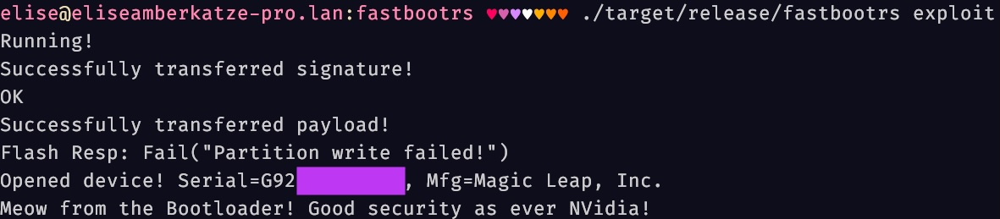

# Magic Leap One Exploitation

## Overview

This folder contains a (messy) implementation of research exploiting the Magic Leap One.

The `fastbooted` folder contains the code that runs on the Magic Leap console.

The `fastbootrs` folder contains a Rust implementation of a Fastboot client, and is the code that runs on the host.

## Vulns

This repository contains implementations of two vulns:

1. Code Execution in CBoot over Fastboot USB by smashing the stack in NVidia's SparseFS parser ([`sparsehax`](../writeups/sparsehax.md))
2. Overwriting CBoot in memory using an oversized `kernel-dtb` implementation on the storage to gain persistant code execution ([`dtbhax`](../writeups/dtbhax.md))

## Usage

Warning: It's your responsibility if you brick your console.

You need a siginfo blob (signed list of hashes with a small header) from a firmware update for your device (this is device unique), any partition works as long as it's for your device. Place it in `fastbootrs/system-sparse-sig.bin`.

Inside the `fastbooted/payload` directory:

1. Copy `sparsehax.ld` to `ccplex.ld`
2. Run `cargo build-usb-bin`
3. Copy the generated `payload.bin` file to `fastbootrs/src/payload.bin`

Put your ML1 console into Fastboot by powering it off, and holding the Vol-Down button whilst powering the console on.

Inside the `fastbootrs` directory:

1. Run `cargo run --release -- exploit`
2. Success?

If these instructions aren't clear enough, this probably is not ready for you.
